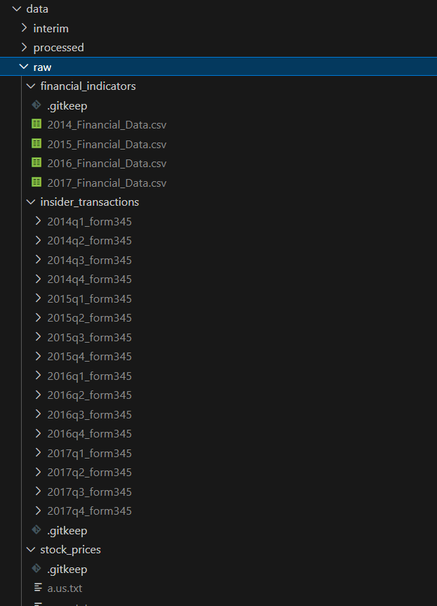

# Insider Trading Analysis and Prediction Platform

## Table of Contents
- [Overview](#overview)
- [Dataset Content](#dataset-content)
  - [1. Insider Trading Data Set](#1-insider-trading-data-set)
  - [2. Stock Price Data](#2-stock-price-data)
- [Hypotheses](#hypotheses-and-how-to-validate)
- [GUI](#Dash-Plotly)
- [Deployment](#deployment)
- [Main Data Analysis and Machine Learning Libraries](#main-data-analysis-and-machine-learning-libraries)
- [Commit Messages Prefixes](#commit-messages-prefixes)
- [Acknowledgements](#acknowledgements)

---

## Overview
Predicting stocks prices is a challenging task due to the inherent volatility and complexity of financial markets. By leveraging insider trading data and financial indicators, we aim to enhance investment strategies and provide valuable insights to investors. 
This project serves as a starting point to predict 'Low', 'High', 'Open', 'Close', and 'Volume' stock prices.
We use two datasets: insider training dataset and stocks price dataset from Kaggle and SEC respectively.
The goal is to enhance the stocks price prediction if necessary by adding more features from the insiders trading dataset.
More optimizations and features can be done as well as more datasets to improve the model accuracy.

- **Aim:** To enhance investment strategies by providing insights and predictions based on insider trading activities and financial indicators.
  
- **Learning Methods:**
  - **Regression Models:** We use LinearRegressor and XGBoostRegressor to predict stock 'Low', 'High', 'Open', 'Close', and 'Volume' prices.

- **Ideal Outcomes:**
  - Accurate stock price predictions.
  - Identification of significant insider trading patterns.

- **Metrics Used:**
  - R2 score
  - RMSE
  - MAPE
---


## Dataset Content

The Insider Trading Analysis and Prediction Platform utilises two primary datasets to analyse and predict stock price movements based on insider trading activities and financial indicators. The datasets have been carefully collected and processed to ensure they are of reasonable size, optimising model training time and adhering to repository size limitations.

The repo structure and file management facilitates easy data access, efficient processing, compliance with data usage policies, and scalability for future extensions.
By running the jupyter notebooks in order by name, the user can first load raw data and process it to become 'interim'.
Afterwards, the user can process it further to become 'processed' and then use it for analysis and prediction.
Features engineering, data cleansing, and sanity checks are performed at those stages to ensure the data is ready for model training and evaluation.
Missing values are handled, categorical encoding is employed, lagged values are created, and moving averages are calculated to enrich the dataset and improve model performance.
Here is the folder structure:


### 1. Insider Trading Data Set
- **Source:** U.S. Securities and Exchange Commission (SEC) EDGAR Database.
- **Description:** This dataset contains detailed records of insider transactions filed with the SEC. Each record represents a transaction made by a company insider, such as executives, directors, or significant shareholders.

#### Data Source:
You can access the insider transactions dataset from the SEC at the following link: [SEC Insider Transactions Dataset](https://www.sec.gov/data-research/sec-markets-data/insider-transactions-data-sets)

#### Focus on Non-Derivative Transactions:
The project focuses on non-derivative insider buys which alignes with the hypothesis of the project and offers a more straightforward and robust signals about stock price impact.
This project emphasizes non-derivative insider buys for the following key reasons:

1. **Clarity in Data**:  
   Non-derivative transactions avoid complexities such as options and conversion rates, resulting in cleaner data for analysis. They directly reflect changes in insider ownership, simplifying the modeling of buying activity.

2. **Market Interpretation**:  
   The market generally interprets non-derivative insider buying (e.g., purchasing common shares) as a stronger and clearer bullish signal compared to derivative transactions, which may serve as hedges or have limited impact on actual share prices.

3. **Direct Ownership Signal**:  
   Non-derivative transactions indicate direct purchases or sales of company shares, showcasing an insider’s immediate and vested interest in the stock's performance. For instance, buying company stock directly signals confidence in the company’s future.

4. **Past Studies and Predictive Insights**:  
   Historical research often shows a stronger correlation between non-derivative insider buying and future price movements, as it explicitly expresses confidence from company leaders.

#### Data Structure and Variables:
The insider trading data is organized into quarterly folders, each containing multiple TSV (Tab-Separated Values) files corresponding to different tables from the SEC filings.

**Primary Tables and Variables:**
- **Trade Date:**
  - **Table:** NONDERIV_TRANS
  - **Variable:** TRANS_DATE
  - **Description:** Transaction date in DD-MON-YYYY format.
  
- **Ticker:**
  - **Table:** SUBMISSION
  - **Variable:** ISSUERTRADINGSYMBOL
  - **Description:** Issuer's trading symbol.

- **Company Name:**
  - **Table:** SUBMISSION
  - **Variable:** ISSUERNAME
  - **Description:** Name of the issuer.

- **Insider Name:**
  - **Table:** REPORTINGOWNER
  - **Variable:** RPTOWNERNAME
  - **Description:** Name of the reporting owner.

- **Insider Position:**
  - **Table:** REPORTINGOWNER
  - **Variables:** RPTOWNER_RELATIONSHIP, RPTOWNER_TITLE
  - **Description:** Role of the insider, detailing if they are an OFFICER, DIRECTOR, TENPERCENTOWNER, or OTHER.

- **Transaction Type:**
  - **Table:** NONDERIV_TRANS
  - **Variable:** TRANS_CODE
  - **Description:** Transaction code representing the type of transaction (e.g., Purchase, Sale).

- **Price:**
  - **Table:** NONDERIV_TRANS
  - **Variable:** TRANS_PRICEPERSHARE
  - **Description:** Price per share for the transaction.

- **Quantity:**
  - **Table:** NONDERIV_TRANS
  - **Variable:** TRANS_SHARES
  - **Description:** Number of shares traded.

- **Owned Shares:**
  - **Table:** NONDERIV_TRANS and NONDERIV_HOLDING
  - **Variable:** SHRS_OWND_FOLWNG_TRANS
  - **Description:** Shares owned following the reported transaction(s).

- **Value:**
  - **Table:** NONDERIV_TRANS
  - **Variable:** VALU_OWND_FOLWNG_TRANS
  - **Description:** Value owned following the reported transaction(s), typically calculated as Price × Quantity for transactions.

#### Key Variables and Data Types:

| Variable Name       | Data Type | Description                                              |
|---------------------|-----------|----------------------------------------------------------|
| Trade Date          | Date      | Date when the transaction occurred.                      |
| Ticker              | String    | Stock ticker symbol of the company.                      |
| Company Name        | String    | Name of the company.                                    |
| Insider Name        | String    | Name of the insider conducting the transaction.         |
| Insider Position     | String    | Role of the insider within the company.                  |
| Transaction Type    | Categorical | Type of transaction (e.g., Purchase, Sale) represented by codes. |
| Price               | Float     | Transaction price per share.                             |
| Quantity            | Integer   | Number of shares traded.                                 |
| Owned Shares        | Integer   | Shares owned after the transaction.                      |
| Value               | Float     | Total value of the transaction (Price × Quantity).      |

#### Data Collection and Processing:
- **Data Retrieval:**
  - Downloaded quarterly filings from the SEC EDGAR database.
  - Extracted relevant tables (NONDERIV_TRANS, SUBMISSION, REPORTINGOWNER) from TSV files.
  
- **Data Cleaning:**
  - Merged tables using common identifiers to consolidate data.
  - Handled missing or null values appropriately.
  - Standardised date formats and decoded transaction codes.

- **Data Storage:**
  - Organised in CSV files for efficient querying and analysis.


### 2. Stock Price Data
- **Source:** Historical stock price data collected for each company.
- **Description:** Contains daily stock price information for each company, stored in individual .txt files per company.

#### Data Source:
You can access the insider transactions dataset from kaggle at the following link: [Huge Stock Market Dataset](https://www.kaggle.com/datasets/borismarjanovic/price-volume-data-for-all-us-stocks-etfs)

#### Data Structure and Variables:
Each .txt file represents a company's stock price data over a period.

**Key Variables and Corresponding Columns:**
- **Date:**
  - **Column:** Date
  - **Description:** Trading date.

- **Ticker:**
  - **Column:** Not present in the sample; needs to be added based on file name or additional column.

- **Open:**
  - **Column:** Open
  - **Description:** Opening price of the stock.

- **High:**
  - **Column:** High
  - **Description:** Highest price during the trading day.

- **Low:**
  - **Column:** Low
  - **Description:** Lowest price during the trading day.

- **Close:**
  - **Column:** Close
  - **Description:** Closing price of the stock.

- **Adjusted Close:**
  - **Column:** Not present; may need to be calculated or retrieved from additional sources.

- **Volume:**
  - **Column:** Volume
  - **Description:** Number of shares traded during the day.

#### Data Collection and Processing:
- **Data Retrieval:**
  - Downloaded historical price data for each company.

- **Data Cleaning:**
  - Added a Ticker column to each file, inferred from the file name.
  - Ensured dates are formatted consistently.
  - Removed Adjusted Close.

- **Data Storage:**
  - Stored as .txt or CSV files, one per company.

---


## Hypotheses

1. **Hypothesis 1:** Using only the stocks dataset, stocks metrics: 'Low', 'High', 'Open', 'Close', and 'Volume' can be predicted using linear approximation with no need for further features or dataset
   - **Conclusion**
     - 'Low', 'High', 'Open', and 'Close', can be approximated at low error and good R2 score with LinearRegressor.
     - 'Volume' exhibited bigger error and negative R2 score with LinearRegressor.

2. **Hypothesis 2:** If there is a coinciding insider activity with stocks trading, 'Volume' LinearRegressor Prediction will suffer if the insider information is ignored.
   - **Conclusion:**
     - Without incorporating any insider features (when they coincide with stocks public trading), the 'Volume' RMSE was in many cases better than points with no coinciding insider activity. 
     - In other cases, the RMSE was worse.
     - The negative R2 score means that the features used in the model are not sufficient to predict the target variable or potentially the model is not the best fit for the data or the target variable is not linearly correlated with the features.


3. **Hypothesis 3:** Using XGBoost (Extreme Gradient Boosting) can improve the 'Volume' regression predictions compared to LinearRegressor.
   - **Conclusion**
     - Indeed, the assumption about potential non-linear relationships between features and the target variable was correct since XGBoost improved the RMSE and R2 score for 'Volume' predictions.

4. **Hypothesis 4:** The 'Volume' prediction can be further improved by incorporating insider trading features and more engineered features (lagged features, moving averages, etc.).
   - **Conclusion**
     - The 'Volume' prediction was further improved.
     - Engineered features made the context of insider information more helpful in predicting the 'Volume' target variable as proven from features importance.
    

---

## GUI

Three different Dash-Plotly interactive web apps were designed. All of them share a similar layout.
For Notebook 3.0 and 5.0, the user selects a date range and then the backend predicts the last 20% of the date period.
The user can select stocks from different companies and get predictions accordingly for various metrics. RMSE, MAPE, and R2 will be reported along with features importance.
Notebook 3.0 will only show the last 20% of the date range, while Notebook 5.0 will show the entire date range and the last 20% for predictions.
The metrics reported on the web apps are for the last 20% of the date range.

1. **Notebook 1.0**
   - **Content:**
     - A visualization of various data points related to stocks and insiders datasets.
     - Allows the user to explore different scenarios and identify patterns/trends.
   - **Related Hypotheses:**
     - Hypothesis 2 can be seen by playing around with the filtering criteria and observing the 'Volume' target variable RMSE and R2 score on The delta subplot.
2. **Notebook 3.0**
   - **Content:**
     - A visualization of future predictions based on the given date range.
     - From the date range, the most recent 20% datapoints will simulate future predictions and show the actual values at the same time.
   - **Related Hypotheses:**
     - Hypothesis 1.
3. **Notebook5.0**
   - **Content:**
     - A visualization of future predictions based on the given date range.
     - From the date range, the most recent 20% datapoints will simulate future predictions and show the actual values at the same time.
   - **Related Hypotheses:**
     - Hypothesis 4 can be seen by playing around with filtering criteria and observing the 'Volume' target variable RMSE and R2 score on The delta subplot.
        - Apple Stock Analysis for the Entire Year of 2014
          - Improved volume RMSE from 2.77e7 (linear regression) to 2.70e7 using XGBoost without lag features and moving averages.
          - Further improved volume RMSE from 2.70e7 to 2.35e7 using XGBoost with lag features, moving averages, and insider data.

        - Apple Stock Analysis for the Period from 2014 to 2017
          - Improved volume RMSE from 2.14e7 (linear regression) to 2.13e7 using XGBoost without lag features and moving averages.
          - Further improved volume RMSE from 2.13e7 to 1.18e7 using XGBoost with lag features, moving averages, and insider data.

        - Hyperparameter Tuning Results
          - Fitting 5 folds for each of 192 candidates, totaling 960 fits. (Below Sample Results Summary)
            - Best hyperparameters found: 
              ```json
              {
                "regressor__colsample_bytree": 0.8,
                "regressor__learning_rate": 0.05,
                "regressor__max_depth": 4,
                "regressor__n_estimators": 300,
                "regressor__subsample": 0.9
              }
              ```
            - Best CV score: 11835991.344843375 (RMSE)
            - Rank 1: 
              ```json
              {
                "regressor__colsample_bytree": 0.8,
                "regressor__learning_rate": 0.05,
                "regressor__max_depth": 4,
                "regressor__n_estimators": 300,
                "regressor__subsample": 0.9
              }
              ```
              with score: 1.18e7
            - Rank 2: 
              ```json
              {
                "regressor__colsample_bytree": 0.8,
                "regressor__learning_rate": 0.05,
                "regressor__max_depth": 4,
                "regressor__n_estimators": 300,
                "regressor__subsample": 0.7
              }
              ```
              with score: 1.21e7
            - Rank 3: 
              ```json
              {
                "regressor__colsample_bytree": 0.8,
                "regressor__learning_rate": 0.05,
                "regressor__max_depth": 4,
                "regressor__n_estimators": 100,
                "regressor__subsample": 0.9
              }
              ```
              with score: 1.21e7

          - Best hyperparameters found: 
            ```json
            {
              "regressor__colsample_bytree": 0.8,
              "regressor__learning_rate": 0.05,
              "regressor__max_depth": 4,
              "regressor__n_estimators": 300,
              "regressor__subsample": 0.9
            }
            
      ---


## Deployment

### Project Setup Guide for Windows

This guide will help you set up the project in a virtual environment and install the necessary dependencies on Windows.

#### Prerequisites

- Ensure you have Python installed (version 3.x).
- Make sure you have Git installed.

#### Steps to Set Up

2. **Create a Virtual Environment**:
   Navigate to the directory where you want to set up the project and create a virtual environment. Replace `myenv` with your desired environment name:
   ```bash
   python -m venv myenv
   ```

3. **Activate the Virtual Environment**:
   Activate the virtual environment:
   ```bash
   myenv\Scripts\activate
   ```

4. **Clone the Repository**:
   Clone the project repository from GitHub.
   ```bash
   git clone https://github.com/OSawani/MarketPulseAnalytics.git
   ```

5. **Navigate into the Project Directory**:
   Change to the directory of the cloned repository:
   ```bash
   cd repository
   ```

6. **Install Dependencies**:
   Install the required dependencies listed in `requirements.txt`:
   ```bash
   pip install -r requirements.txt
   ```

#### Additional Information

- To deactivate the virtual environment, simply run:
  ```bash
  deactivate
  ```

**Heroku**  
The App live link is: [https://insider-trading-analysis.herokuapp.com/](https://insider-trading-analysis.herokuapp.com/) (Link will be updated upon deployment.)  
**Python Version:** Specified in runtime.txt (e.g., python-3.8.10)  

**Deployment Steps:**
  1. **Log in to Heroku and Create an App**
    - Navigate to the Heroku dashboard and click "New" > "Create new app."
    - Enter a unique app name and select the appropriate region.
    
  2. **Set Up Deployment Method**
    - Go to the "Deploy" tab.
    - Under "Deployment method," select "GitHub."
    - Connect your GitHub account if not already connected.

  3. **Connect to GitHub Repository**
    - Search for your repository name and click "Connect."

  4. **Deploy the Branch**
    - Select the branch you want to deploy (e.g., main).
    - Click "Deploy Branch."
    - Monitor the build logs to ensure successful deployment.

  5. **Open the App**
    - Once deployment is complete, click "Open App" to access the application.

  6. **Handle Slug Size Issues**
    - If the slug size exceeds Heroku's limits:
      - Add large files not required for the app to the .slugignore file.
      - Optimize dependencies listed in requirements.txt by removing unnecessary packages.

---


## Main Data Analysis and Machine Learning Libraries

- **Pandas**
  - Used for data manipulation and analysis.
  - Example: Reading CSV and TSV files, merging datasets, handling missing values.

- **NumPy**
  - Supports numerical operations on large, multi-dimensional arrays.
  - Example: Calculating statistical measures like mean and standard deviation.

- **Scikit-Learn and XGBOOST**
  - Provides tools for data mining and data analysis.
  - Example:
    - Implementing regression models (Linear Regression, Random Forest Regressor).
    - Clustering algorithms (K-Means).
    - Model evaluation metrics (R² score, MSE).

- **Matplotlib and Seaborn**
  - Libraries for creating static, animated, and interactive visualisations.
  - Example: Plotting time-series data, creating scatter plots, heatmaps.

- **Plotly**
  - Enables creation of interactive visualisations.
  - Example: Building interactive charts dashboard.

- **Dash Plotly**
  - An open-source app framework for machine learning and data science.
  - Example: Developing the user interface and interactive elements of the dashboard.
---


## Commit Messages Prefixes
1. **feat:** A new feature or functionality.
   - Example: `feat: add data preprocessing step`
   
2. **fix:** A bug fix or correction.
   - Example: `fix: resolve data loading error`
   
3. **docs:** Documentation changes or updates.
   - Example: `docs: update README with usage instructions`
   
5. **refactor:** Code changes that neither fix a bug nor add a feature but improve structure.
   - Example: `refactor: simplify model training code`
   
7. **chore:** Routine tasks that are not related to code (e.g., updates to dependencies).
   - Example: `chore: update project dependencies`


## Acknowledgements
- **Instructors and Mentors:**
  - Special thanks to the educators and mentors who provided guidance throughout the development of this project.
  
- **Open-Source Community:**
  - Gratitude to the developers and contributors of the open-source libraries used in this project.
  
- **Data Providers:**
  - Appreciation for the platforms (Kaggle & SEC) offering access to financial and market data, enabling the creation of this application.

---

